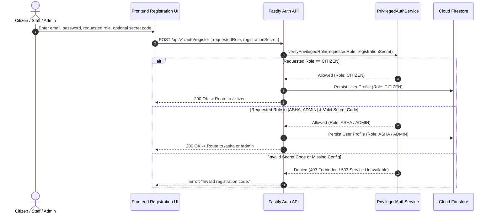

# Privileged Account Provisioning & Security Architecture

SwasthyaSetu enforces strict, server-side cryptographic protection for privileged account provisioning (`ASHA` and `ADMIN` roles), while keeping `CITIZEN` registration open and accessible.

---

## 1. Security Architecture & Invariants

1. **Server-Authoritative Boundary**: The frontend React/Next.js client is never the authority for assigning roles. Roles are evaluated, cryptographically verified against server-side secret hashes, and assigned strictly on the Fastify backend.
2. **Fail-Closed by Design**: If `ASHA_REGISTRATION_SECRET_HASH` or `ADMIN_REGISTRATION_SECRET_HASH` is not configured in the backend environment, privileged account creation immediately fails closed with HTTP `503 Service Unavailable` (`"Privileged account registration is currently unavailable."`).
3. **Zero Secret Storage in Client/Database**: Neither raw registration secrets nor environment secret hashes are ever written to Firestore user profiles, client bundles, `localStorage`, or API responses.
4. **Rate Limiting & Brute-Force Throttling**: Repeated failed privileged registration attempts are automatically throttled per identifier (HTTP `429 Too Many Requests`).
5. **Auditable Security Events**: Privileged registration attempts generate structured audit log entries containing safe, masked metadata (`maskedEmail`, `requestedRole`, `correlationId`, `event: PRIVILEGED_REGISTRATION_SUCCESS | PRIVILEGED_REGISTRATION_FAILED`).

---

## 2. Generating & Configuring Privileged Secrets

### Step 1: Generate a SHA-256 Hash
Run the backend helper script with your secret code:
```bash
cd backend
npx tsx scripts/generate-secret-hash.ts <YourSecretCode>
```

Example output:
```
==================================================
SWASTHYASETU PRIVILEGED REGISTRATION SECRET HASH
==================================================
Secret Length: 15 characters
SHA-256 Hash : 7840f5be2628fbe2b49c25a2e86393a1492ba7c824ce27d522b1b5e40621e87f

To configure in backend/.env:
ASHA_REGISTRATION_SECRET_HASH=7840f5be2628fbe2b49c25a2e86393a1492ba7c824ce27d522b1b5e40621e87f
==================================================
```

### Step 2: Configure Environment Variables
In `backend/.env` (server-side only; never in `frontend/.env.local` or as `NEXT_PUBLIC_*`):
```env
# SHA-256 hashes of registration secrets for ASHA and ADMIN provisioning
ASHA_REGISTRATION_SECRET_HASH=<sha256_hash_for_asha>
ADMIN_REGISTRATION_SECRET_HASH=<sha256_hash_for_admin>
```

### Step 3: Restart Backend Server
Restart the Fastify backend service. The server will now validate incoming registration codes against the configured hashes.

---

## 3. Provisioning Workflow



---

## 4. API Endpoints

- `POST /api/v1/auth/register` (or `POST /api/v1/auth/sync`)
  - **Headers**: `Authorization: Bearer <Firebase_ID_Token>`
  - **Body**:
    ```json
    {
      "displayName": "Sunita Devi",
      "requestedRole": "ASHA",
      "registrationSecret": "<AUTHORIZED_STAFF_SECRET>"
    }
    ```
  - **Responses**:
    - `200 OK`: Successful registration with assigned role.
    - `403 Forbidden`: Invalid or mismatched registration code.
    - `429 Too Many Requests`: Throttled after repeated failed attempts.
    - `503 Service Unavailable`: Privileged registration hash unconfigured on server.

---

## 5. Automated Test Coverage

The implementation includes 17 dedicated security unit and integration tests in `backend/tests/privileged-registration.test.ts`:
- Citizen open registration & default role assignment
- Privilege escalation prevention (citizen requesting ASHA/Admin without secrets)
- ASHA valid secret verification & cross-role attack prevention
- Admin valid secret verification & cross-role attack prevention
- Fail-closed behavior on missing environment configuration
- Rate limiting on brute-force secret guessing
- Sensitive secret & hash leakage prevention in logs and responses
