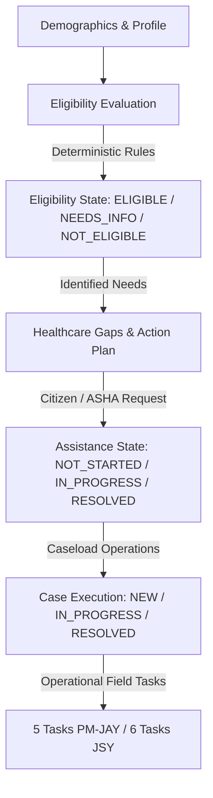

# SwasthyaSetu — Scheme Assistance State-Lifecycle & Synchronization Architecture

## 1. Executive Summary & Core Principles

This document defines the single source of truth for healthcare assistance workflows across the **Citizen**, **ASHA Worker**, and **System Administrative** portals of the SwasthyaSetu platform.

### Core Architectural Separation
The platform enforces a strict separation between four distinct state layers:



1. **Eligibility State**: Deterministic result (`ELIGIBLE` | `NEEDS_INFORMATION` | `NOT_ELIGIBLE`) evaluating whether the household/member meets the published scheme rules based on demographics, age, ration category, and maternal status.
2. **Healthcare Support / Gaps State**: Actionable requirements (`REQUIRED` | `IMPORTANT` | `GOOD_TO_HAVE`) indicating where government entitlement registration has not yet been obtained.
3. **Assistance State**: Operational tracking of doorstep ASHA facilitation (`NOT_STARTED` | `IN_PROGRESS` | `RESOLVED` | `CLOSED`). *Assistance completion records that the ASHA worker completed their verified facilitation steps, without falsely claiming government benefit issuance unless officially confirmed.*
4. **Case Execution State**: Caseload record (`NEW` | `IN_PROGRESS` | `RESOLVED` | `CLOSED`) assigned to an ASHA worker.

---

## 2. State Transition Lifecycle Matrix

### A. PM-JAY (Ayushman Bharat — Senior Citizen & Vulnerable Household)

| Stage | Case Status | Assistance Status | Journey Milestones | Field Tasks | Gaps View (ASHA & Citizen) | Button State |
| :--- | :--- | :--- | :--- | :--- | :--- | :--- |
| **Unassisted** | `NEW` | `NOT_STARTED` (None) | None (0) | None (0) | `REQUIRED` / Red | `[ Start Assistance ]` |
| **Initiated** | `IN_PROGRESS` | `IN_PROGRESS` | 7 Milestones (1st Active) | 5 Tasks (0/5 Completed) | `IN PROGRESS` / Blue | `[ Continue Assistance ]` |
| **Step 1: KYC** | `IN_PROGRESS` | `IN_PROGRESS` | 7 Milestones (2nd Active) | 5 Tasks (1/5 Completed) | `IN PROGRESS` / Blue | `[ Continue Assistance ]` |
| **Step 2: Consent** | `IN_PROGRESS` | `IN_PROGRESS` | 7 Milestones (3rd Active) | 5 Tasks (2/5 Completed) | `IN PROGRESS` / Blue | `[ Continue Assistance ]` |
| **Step 3: Portal** | `IN_PROGRESS` | `IN_PROGRESS` | 7 Milestones (4th Active) | 5 Tasks (3/5 Completed) | `IN PROGRESS` / Blue | `[ Continue Assistance ]` |
| **Step 4: Card** | `IN_PROGRESS` | `IN_PROGRESS` | 7 Milestones (5th Active) | 5 Tasks (4/5 Completed) | `IN PROGRESS` / Blue | `[ Continue Assistance ]` |
| **Step 5: Handover** | `RESOLVED` | `RESOLVED` | 7 Milestones (7/7 Completed) | 5 Tasks (5/5 Completed) | `ASSISTANCE COMPLETED` / Emerald | `[ View Completed Journey ]` |

#### PM-JAY Operational Field Tasks (0/5 → 5/5)
1. `Verify Aadhaar & Senior Age (70+)`: Verify physical Aadhaar card and identity.
2. `Collect e-KYC Consent & Biometrics`: Collect beneficiary consent for official e-KYC.
3. `Submit Application on NHA Beneficiary Portal`: Assist citizen with registration on `beneficiary.nha.gov.in` or nearest CSC kiosk.
4. `Download & Verify Ayushman Card`: Download digital Ayushman Card / verify PM-JAY ID.
5. `Deliver Card & Explain Empanelled Hospitals`: Hand over printed card and provide list of nearest empanelled hospitals.

---

### B. JSY (Janani Suraksha Yojana — Maternal Health & Institutional Delivery)

| Stage | Case Status | Assistance Status | Journey Milestones | Field Tasks | Gaps View (ASHA & Citizen) | Button State |
| :--- | :--- | :--- | :--- | :--- | :--- | :--- |
| **Unassisted** | `NEW` | `NOT_STARTED` (None) | None (0) | None (0) | `REQUIRED` / Red | `[ Start Assistance ]` |
| **Initiated** | `IN_PROGRESS` | `IN_PROGRESS` | 8 Milestones (1st Active) | 6 Tasks (0/6 Completed) | `IN PROGRESS` / Blue | `[ Continue Assistance ]` |
| **Step 1: MCP Card** | `IN_PROGRESS` | `IN_PROGRESS` | 8 Milestones (2nd Active) | 6 Tasks (1/6 Completed) | `IN PROGRESS` / Blue | `[ Continue Assistance ]` |
| **Step 2: ANC Check** | `IN_PROGRESS` | `IN_PROGRESS` | 8 Milestones (3rd Active) | 6 Tasks (2/6 Completed) | `IN PROGRESS` / Blue | `[ Continue Assistance ]` |
| **Step 3: Bank Sync** | `IN_PROGRESS` | `IN_PROGRESS` | 8 Milestones (4th Active) | 6 Tasks (3/6 Completed) | `IN PROGRESS` / Blue | `[ Continue Assistance ]` |
| **Step 4: Birth Plan** | `IN_PROGRESS` | `IN_PROGRESS` | 8 Milestones (5th Active) | 6 Tasks (4/6 Completed) | `IN PROGRESS` / Blue | `[ Continue Assistance ]` |
| **Step 5: Facility** | `IN_PROGRESS` | `IN_PROGRESS` | 8 Milestones (6th Active) | 6 Tasks (5/6 Completed) | `IN PROGRESS` / Blue | `[ Continue Assistance ]` |
| **Step 6: DBT Credit**| `RESOLVED` | `RESOLVED` | 8 Milestones (8/8 Completed) | 6 Tasks (6/6 Completed) | `ASSISTANCE COMPLETED` / Emerald | `[ View Completed Journey ]` |

#### JSY Operational Field Tasks (0/6 → 6/6)
1. `MCP Card Registration`: Register pregnancy at local Anganwadi/PHC and issue Mother and Child Protection (MCP) card.
2. `Schedule 1st & 2nd ANC Checkups`: Schedule and accompany pregnant mother to Primary Health Centre for ANC checkup.
3. `Verify Aadhaar-Linked Bank Account`: Verify pregnant mother's active Aadhaar-seeded bank account for DBT transfer.
4. `Institutional Delivery Micro-Birth Plan`: Prepare institutional delivery plan and identify accredited public health facility / empanelled hospital.
5. `Accompany for Institutional Delivery`: Escort mother to health facility for delivery and ensure post-delivery stay.
6. `Confirm JSY Cash Benefit Disbursal`: Confirm ₹1,400 (rural) or ₹1,000 (urban) DBT cash benefit credited to mother's account.

---

## 3. Forensic Root-Cause Analysis & Fixes Implemented

### Bug #1: Journey Appears Completed Before Starting
- **Root Cause**: The journey tab was statically rendering milestone progress bars as 100% or reading raw eligibility flags without verifying if an active case workflow had actually been initialized.
- **Fix**: Implemented clear **`ASSISTANCE NOT STARTED`** empty state in `frontend/app/asha/page.tsx`. When `caseDetail.case.status === "NEW"` or `tasks.length === 0`, it displays verified opportunity cards with target beneficiary names, matched rules, and an active `[ Start Assistance ]` trigger.

### Bug #2: PM-JAY Start Assistance State Transition
- **Root Cause**: Starting assistance created backend records but lacked instant frontend re-fetching of all dependent stores (`loadCaseload()`, `loadFollowUps()`, `loadAttentionSignals()`, `loadAssistanceRequests()`), leaving the UI out of sync.
- **Fix**: Refactored `handleInitiateScheme` and `handleCompleteTask` in `frontend/app/asha/page.tsx` to atomically re-fetch case detail, switch to the journey tab, and refresh all caseload views concurrently with loading state indicators (`initiatingSchemeId`).

### Bug #3: Healthcare Gap Remains Red After Assistance
- **Root Cause**: The Healthcare Gaps tab evaluated static gaps from the rule engine without cross-referencing resolved assistance requests or resolved cases.
- **Fix**:
  - In `backend/src/services/case.service.ts`, `getCaseDetail` aggregates `assistanceRequests` from `assistanceRepo.listRequestsByHouseholdId(householdId)`.
  - In `frontend/app/asha/page.tsx` (Gaps Tab) and `frontend/app/citizen/page.tsx` (Action Plan Tab), cards inspect whether an active assistance request exists for that scheme. When completed (`RESOLVED` or `CLOSED`), cards render in emerald with `✓ ASSISTANCE COMPLETED` and provide a `[ View Completed Journey ]` button.

### Bug #4: Cross-Portal State Synchronization
- **Root Cause**: Updates to case tasks did not update the citizen's assistance request record, causing citizen tracking and ASHA tracking to diverge.
- **Fix**: Synchronized completion of the final task in `backend/src/services/case.service.ts` to automatically update linked `AshaAssistanceRequest` records to `RESOLVED`, update `case.status = "RESOLVED"`, set `currentJourneyStep = "CASE_RESOLVED"`, mark all journey steps `COMPLETED`, and clear `nextFollowUpAt`.

### Bug #5: JSY Start Assistance Failure
- **Root Cause**: Button click handlers in Gaps and Schemes tabs were not resolving the pregnant female member ID (`beneficiaryMemberId`) and had silent `.catch(() => {})` handlers masking errors.
- **Fix**: Added explicit member resolution for JSY (`m.maternalStatus === "pregnant"`), added full loading and error banner states (`errorMessage`), and validated complete JSY initiation path from Gaps, Schemes, and Unstarted Journey cards.

---

## 4. Single Source of Truth & Counting Model Rules

1. **Task Counter Definition**: `COMPLETED FIELD TASKS / TOTAL FIELD TASKS`.
   - **PM-JAY**: Exactly 5 field tasks. Progress is `0/5 → 1/5 → 2/5 → 3/5 → 4/5 → 5/5`.
   - **JSY**: Exactly 6 field tasks. Progress is `0/6 → 1/6 → 2/6 → 3/6 → 4/6 → 5/6 → 6/6`.
   - **Never 11/11**: Tasks from different schemes must never be conflated.
2. **Milestones vs Tasks**:
   - Milestones represent high-level policy stages (7 for PM-JAY, 8 for JSY).
   - Tasks represent ASHA operational checkboxes (5 for PM-JAY, 6 for JSY).
3. **Button Interaction States**:
   - `NOT_STARTED` -> `[ Start Assistance ]` (Green) / `[ Starting... ]` (Disabled spinner)
   - `IN_PROGRESS` -> `[ Continue Assistance ]` / `[ Continue Journey ]` (Blue)
   - `COMPLETED / RESOLVED` -> `[ View Completed Journey ]` / `[ View Journey History ]` (Emerald)

---

## 5. Automated Verification & Test Coverage

All state transitions and counting invariants are verified by the automated Vitest test suite in `backend/tests/scheme-assistance-state-lifecycle.test.ts`.

### Running Tests
```bash
# Run backend state lifecycle suite
npm test --prefix backend tests/scheme-assistance-state-lifecycle.test.ts

# Run all 36 backend test suites (287 tests)
npm test --prefix backend

# Validate frontend compilation and build
npm run build --prefix frontend
```
